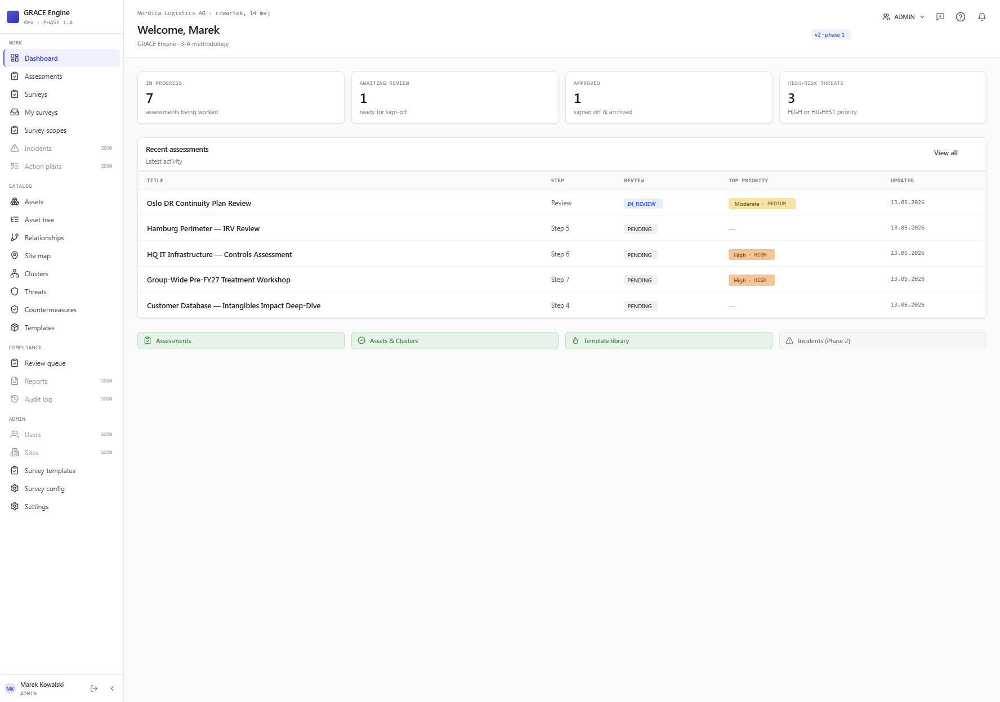
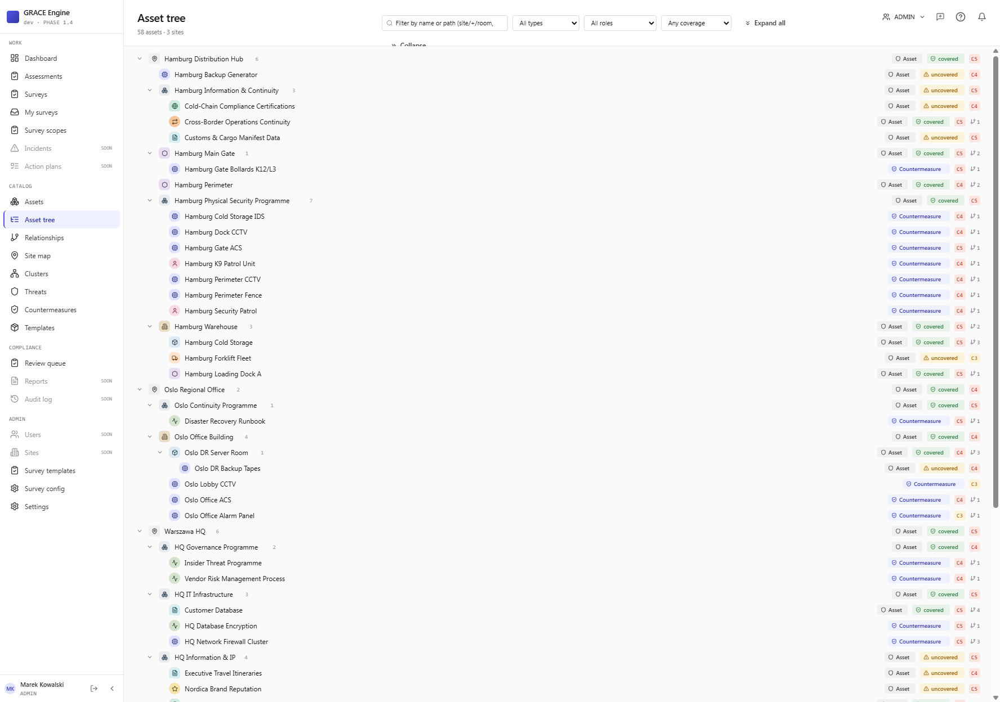
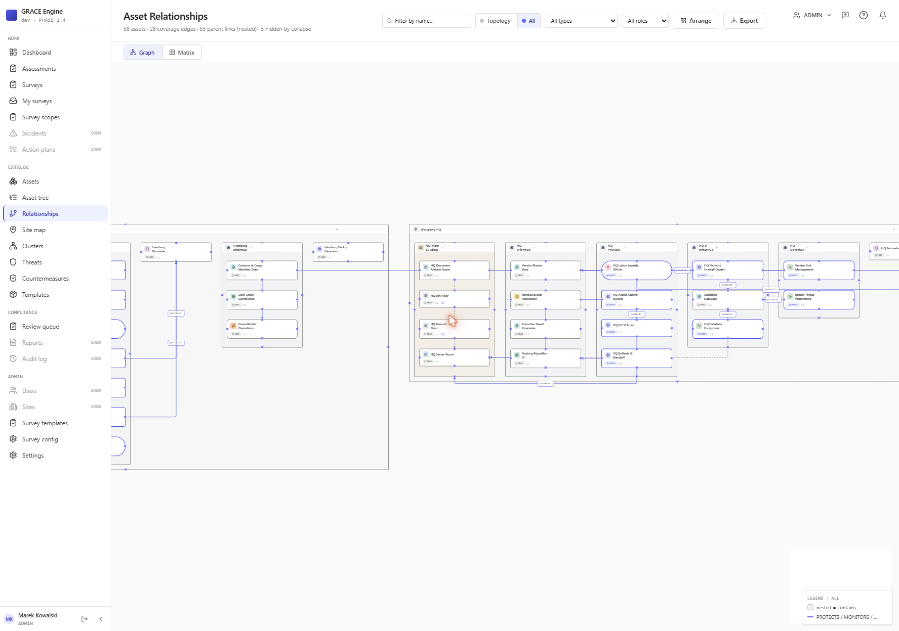
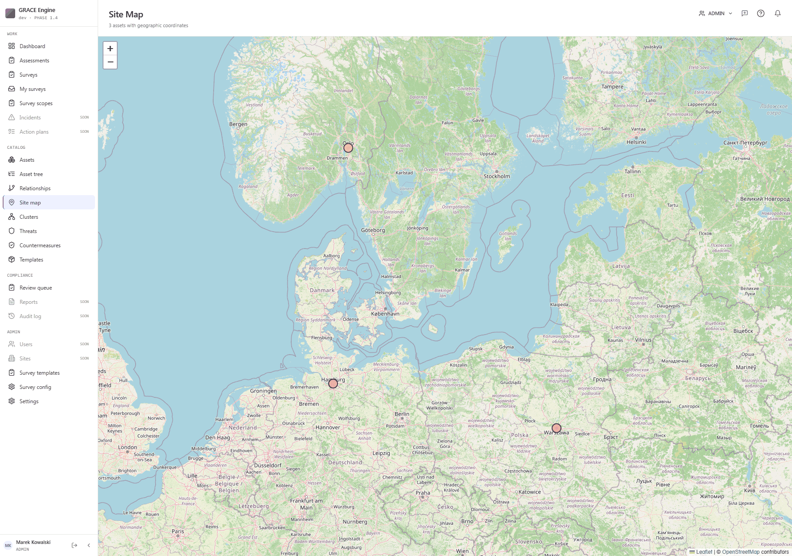
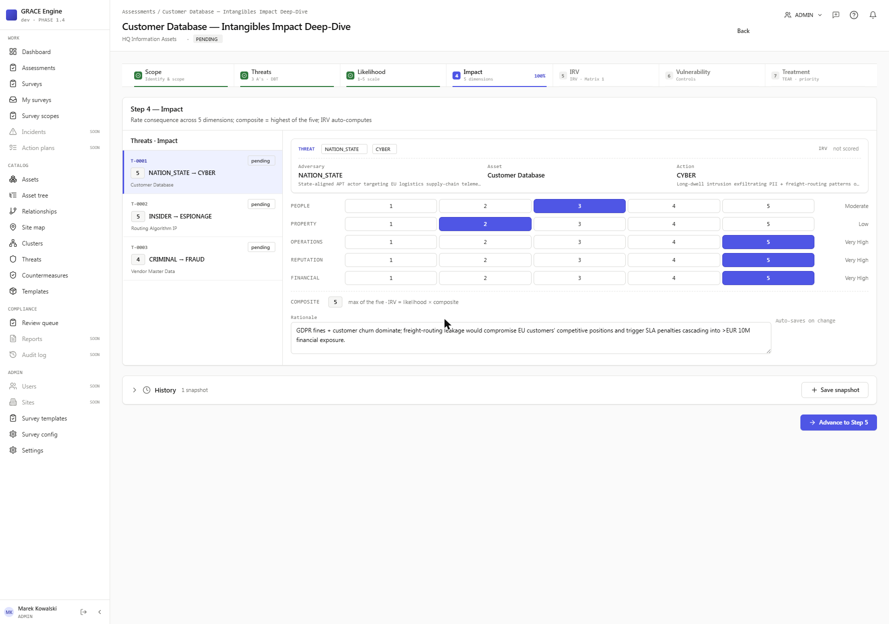
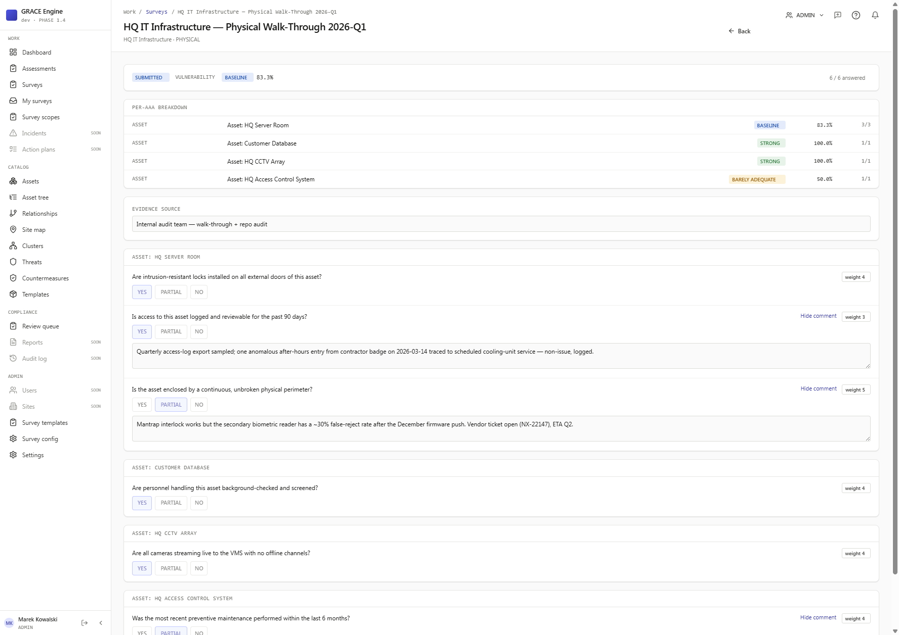
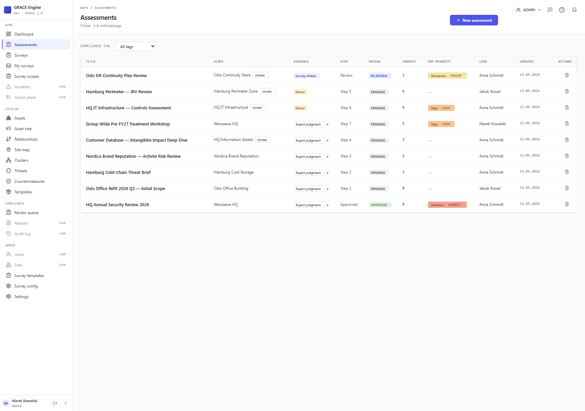
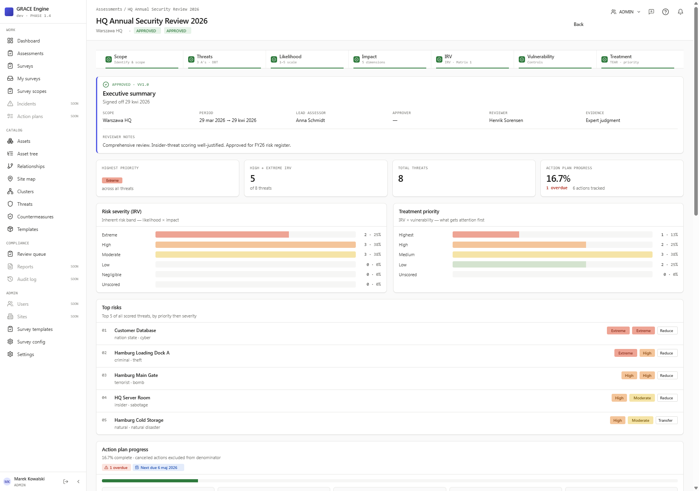
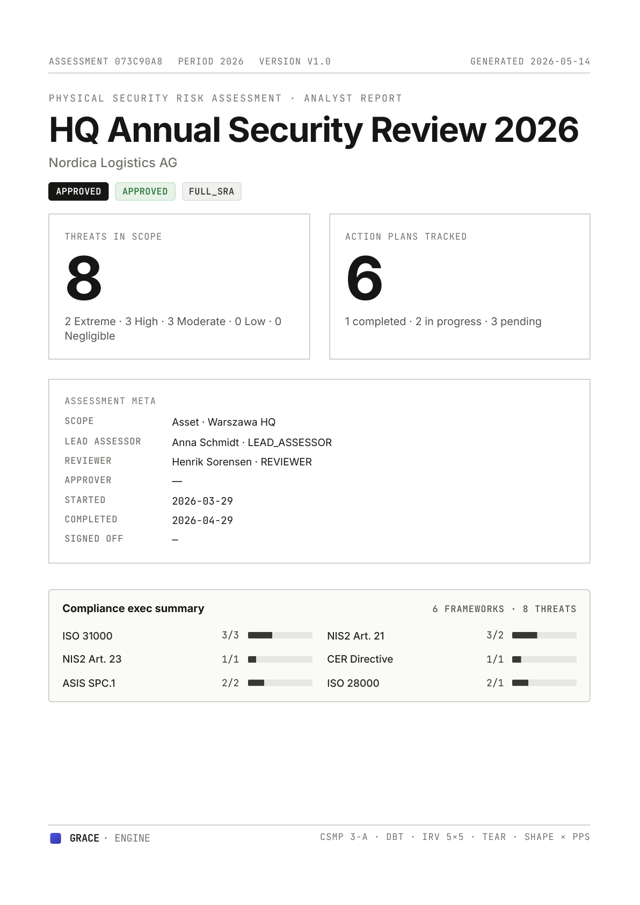
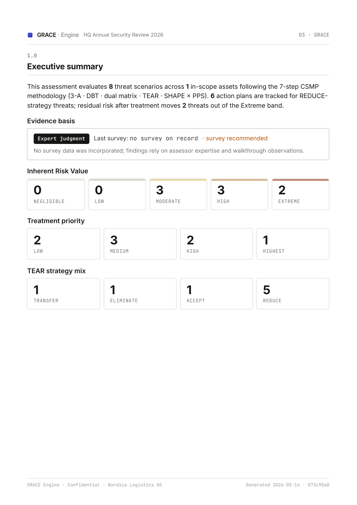

# GRACE Engine

[](https://github.com/mtspl/csmp_v2/actions/workflows/ci.yml) [](./LICENSE) [](./COMMERCIAL_LICENSE.md)

**Self-hostable physical security risk assessment platform built on the CSMP (Critical Site Management Programme) methodology.**

Adversary/Action/Asset threat modelling, Inherent Risk Value (IRV) + Priority scoring, SHAPE/PPS countermeasures with ALARP justification, TEAR treatment strategies, and NIS2/CER/ISO 31000/ASIS SPC.1/ISO 28000 compliance tagging — in one open-source, API-first, single-tenant self-host platform.

Live demo: **https://demo.csmp.marekmalczewski.pl/** · Login `admin@nordica.demo` / `Demo123!`

## Screenshots

### Dashboard — assessment posture at a glance



### Asset tree — Site → Building → Floor → Room → Equipment hierarchy

58 assets across 3 sites. Each row shows asset type, coverage status, criticality (C1–C5), and edge count. Countermeasures appear inline next to the assets they protect.



### Asset relationships — typed graph

Site → Building → Floor → Room → Equipment hierarchy plus typed edges (DEPENDS_ON, PROTECTS, SERVES, CONTAINS, COMMUNICATES_WITH, ADJACENT_TO, SUPPLIES). Risk colour propagates along protective edges.



### Site map — risk-coloured geographic pins

Leaflet view of every geocoded asset. Pin colour reflects current criticality so high-impact sites stand out at a glance.



### 7-step risk assessment wizard — Step 4, Impact

5-dimension impact rating (People · Property · Operations · Reputation · Financial) with composite = max-of-five and live IRV recompute. The 3-A threat model (Adversary × Action × Asset) is visible at the top.



### Surveys — field evidence capture

YES/PARTIAL/NO with weighted scoring, per-question comments, and per-asset breakdown. Survey rating (Strong / Baseline / Barely adequate / Inadequate) feeds the wizard's Step 5 Vulnerability rating.



### Assessments — review workflow

Per-row: scope (asset or cluster), evidence basis (Expert judgment / Survey-linked / Mixed), current wizard step, review state (PENDING → IN_REVIEW → APPROVED), threat count, top priority, lead.



### Approved assessment — executive summary

In-app cover view of a signed-off assessment: IRV distribution, treatment-priority distribution, top risks, action-plan progress, TEAR strategy mix, compliance-framework coverage, and protective-asset coverage.



### PDF report — analyst variant

Auto-generated PDF report (Puppeteer) — cover page + executive summary + per-threat detail. Branded GRACE Engine; methodology references CSMP 3-A in the footer line.




## What you get

- **7-step guided assessment wizard** (Scope → Assets → Threats → Likelihood → Impact → IRV → Vulnerability → Treatment)
- **3-A threat model** — adversary × action × asset, with optional DBT (Design Basis Threat) reference
- **Risk engine** — 5×5 IRV + 5×4 Priority matrices, vulnerability-weighted risk treatment priority
- **Countermeasures catalogue** — SHAPE (Security-Programme / Human / Architectural / Procedural / Equipment) × PPS functions (Deter / Detect / Delay / Deny / Disrupt / Defeat / Recover) × protection domain
- **TEAR strategies** — Transfer / Eliminate / Accept / Reduce + ALARP rationale
- **Action plans** with compliance tags, owners, and target dates
- **Assessment snapshots** for review/approve/reject/manual-save audit trail
- **Asset catalogue** — Site → Building → Floor → Room → Equipment hierarchy, clusters, typed relationships
- **Site map** — Leaflet view of geocoded sites
- **Template Library** — Banking & Finance threat pack out-of-the-box, extensible
- **Review workflow** — PENDING → IN_REVIEW → APPROVED/REJECTED/REVISION_REQUESTED with snapshot hooks
- **PDF export** of approved assessments (Puppeteer)
- **REST API** with Swagger UI at `/api/docs`, JWT auth, per-role RBAC (Admin / Lead Assessor / Assessor / Reviewer / Stakeholder)

## Quick start (self-host)

```bash
git clone https://github.com/grace-pse/grace.git
cd grace
cp docker/.env.example docker/.env        # edit JWT_SECRET, POSTGRES_PASSWORD
docker compose -f docker/docker-compose.yml up -d
```

Open **http://localhost:8080** and complete the one-time bootstrap form. The first user becomes the instance admin; the `/register` endpoint then 410s.

Want demo data? Load the Nordica scenario:

```bash
docker compose -f docker/docker-compose.yml exec api pnpm db:seed -- --reset
# Login: admin@nordica.demo / Demo123!
```

## Development

```bash
pnpm install
cp server/.env.example server/.env        # JWT_SECRET, DATABASE_URL
pnpm db:generate
pnpm db:migrate
pnpm dev                                  # api on :3001, web on :5173
```

Stack: **Fastify + Prisma + PostgreSQL** on the server, **Vite + React 19 + TanStack Router + Zustand + ky + Tailwind v3** on the client, shared types in `@csmp/shared`. Zod validates every HTTP boundary; OpenAPI is generated from the schemas and served at `/api/docs`.

```
grace/
├── client/    # Vite + React app (:5173)
├── server/    # Fastify API (:3001)
├── shared/    # TS types shared across the wire
└── docker/    # docker-compose for self-host
```

## License

**Dual-licensed.** Community use is free under **AGPL-3.0** (see [LICENSE](./LICENSE)). If AGPL-3.0 is incompatible with your deployment (embedded in a closed-source SaaS product, OEM distribution, etc.), a paid **commercial licence** is available — see [COMMERCIAL_LICENSE.md](./COMMERCIAL_LICENSE.md).

## Contributing

Pull requests are welcome. We use the [Developer Certificate of Origin](https://developercertificate.org/) — sign off commits with `git commit -s`. See [CONTRIBUTING.md](./CONTRIBUTING.md). By participating, you agree to abide by the [Code of Conduct](./CODE_OF_CONDUCT.md).

Found a security issue? **Do not open a public issue.** See [SECURITY.md](./SECURITY.md) for responsible disclosure.

## Enterprise

Need SSO/SAML, multi-tenant deployment, data migration from an existing risk register, a managed SaaS build, or priority support? [Fill out the enterprise interest form](#) _(link coming soon)_ or email **contact@grace-ps.io**.
