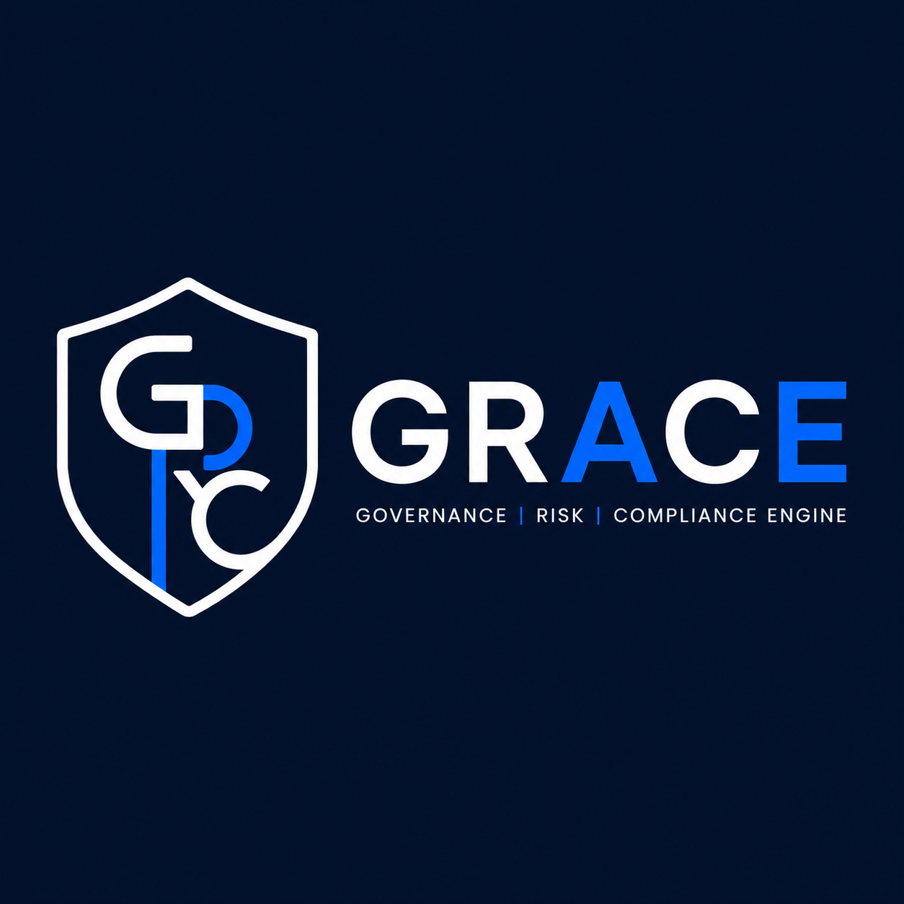

<p align="center">
  
</p>

<h1 align="center">GRACE Engine</h1>
<p align="center"><em>Governance Risk Assessment Compliance Engine</em></p>

> Open-source physical security risk assessment platform aligned with NIS2 & ISO 27001.

[](https://github.com/grace-pse/grace/actions/workflows/ci.yml)


[](./LICENSE)
[](./COMMERCIAL_LICENSE.md)

## What is GRACE Engine?

GRACE Engine is an end-to-end platform for running rigorous physical security risk assessments — adversary / action / asset threat modelling, vulnerability-weighted risk treatment, TEAR + ALARP controls, and audit-ready PDF reports — built for NIS2, ISO 27001, and ISO 31000 work.

## Quick Start (Docker)

```bash
git clone https://github.com/grace-pse/grace.git
cd grace
cp docker/.env.example docker/.env       # edit JWT_SECRET, POSTGRES_PASSWORD
docker compose -f docker/docker-compose.yml up -d
```

Open **http://localhost:8080**, register, and your first user becomes the org admin.

Or try the hosted demo: **https://demo.grace-ps.io** · login `admin@nordica.demo` / `demo123`

## What's inside

- **7-step risk assessment wizard** — TEAR + ALARP methodology, CASCADE_DOWN asset resolution, autosave
- **Asset & relationship graph** — Site → Building → Floor → Room → Equipment, typed edges, React Flow + dagre
- **Site map** — Leaflet view of geocoded sites with risk pins
- **PDF report export** — Puppeteer-rendered, approved-snapshot driven
- **Multi-user with Reviewer / Approve workflow** — PENDING → IN_REVIEW → APPROVED / REJECTED / REVISION_REQUESTED, audit-ready snapshots on every transition
- **5 roles** — Admin / Editor / Reviewer / Viewer / Auditor
- **Template library** — NIS2 and ISO 27001 threat frameworks out-of-the-box, extensible

## Methodology

GRACE Engine implements adversary × action × asset threat modelling, a 5×5 Inherent Risk Value matrix, a 5×4 Priority matrix, vulnerability-weighted risk treatment priority, and TEAR strategies (Transfer / Eliminate / Accept / Reduce) with ALARP justification. See [docs/methodology/](./docs/methodology/) for the full write-up.

## Who is this for

- Security consultants performing risk assessments for clients
- Compliance officers managing NIS2 obligations
- Facility and operations managers documenting physical security posture
- Internal audit teams that need a defensible paper trail

## What's NOT included (Enterprise)

- Multi-tenant (multiple organizations per instance)
- Incidents & incident management
- Advanced reporting & custom dashboards
- SLA support & onboarding

Enterprise waitlist: email **contact@grace-ps.io** _(public form coming soon)_

## Screenshots

_Coming soon — screenshots will be added in Phase 6._

## Roadmap

See [CHANGELOG.md](./CHANGELOG.md) for what's shipped and what's planned.

## Contributing

See [CONTRIBUTING.md](./CONTRIBUTING.md). We use the [Developer Certificate of Origin](https://developercertificate.org/) — sign your commits with `git commit -s`. By participating, you agree to abide by the [Code of Conduct](./CODE_OF_CONDUCT.md).

Found a security issue? **Do not open a public issue.** See [SECURITY.md](./SECURITY.md) for responsible disclosure.

## License

AGPLv3 for open-source use — see [LICENSE](./LICENSE). A commercial license is available for closed-source / OEM / SaaS embedding — see [COMMERCIAL_LICENSE.md](./COMMERCIAL_LICENSE.md) or contact **contact@grace-ps.io**.
